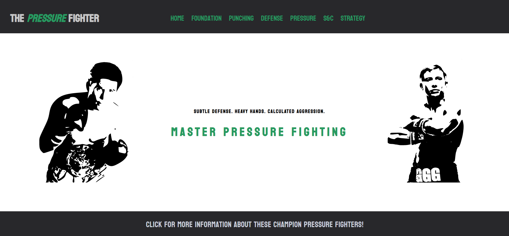
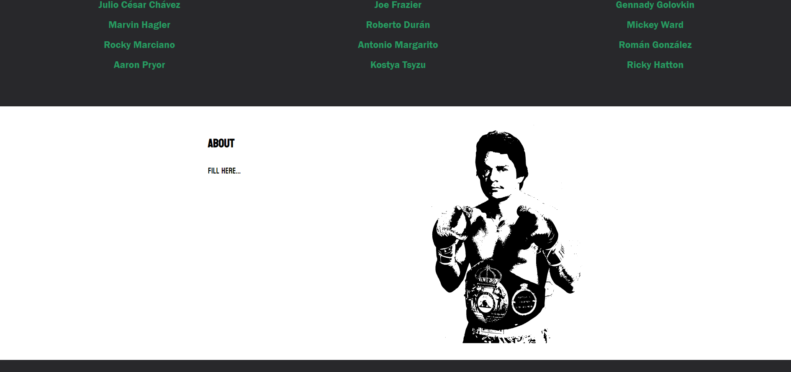
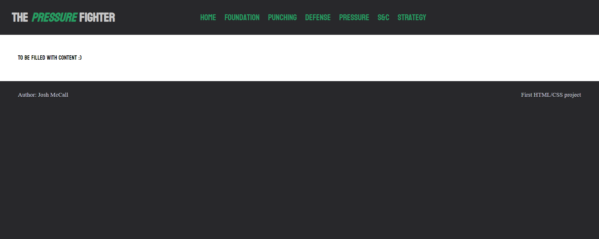
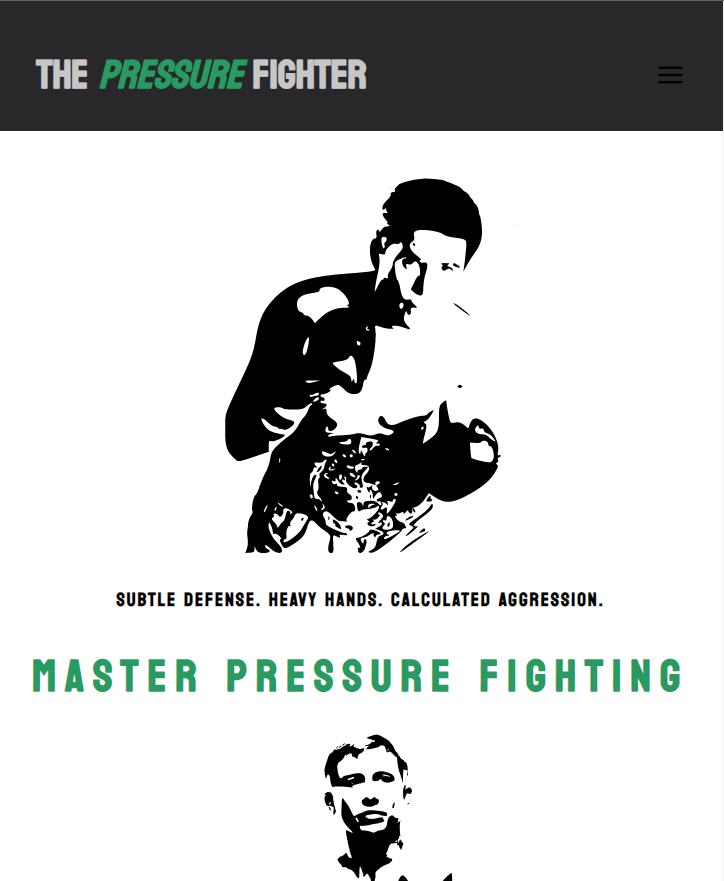
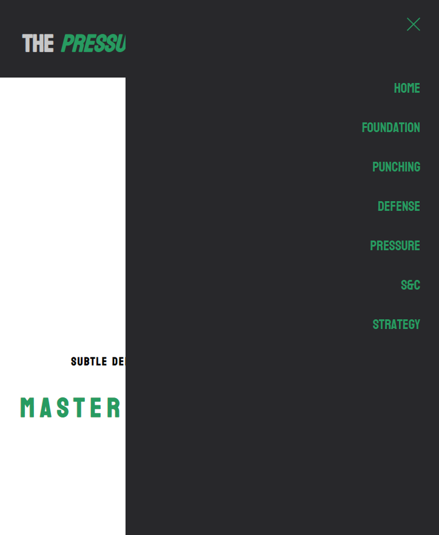

# First-Project
First attempt at using HTML and CSS

## Objective

I wanted to test the skills I'd learned from the Responsive Web Design FreeCodeCamp course so decided to design a website about something I like.
Not many boxing gyms (in the UK at least) teach a style of boxing known as pressure fighting which is my personal favourite style. So, I decided to build a website which teaches pressure fighting from the ground up.

## First Step - HTML

I already had a good idea of what needed to be included in the website so I practically knew which components I had to include in the HTML to cover everything I needed. I then built the HTML framework (the home.html file) using classes for later styling with CSS.
Overall, I found the HTML pretty straight forward but also fairly tedious in parts as it's a lot of the same sort of stuff repeated.

## Second Step - Mobile First CSS

As I wanted a mobile responsive website I decided to use mobile first CSS.
In order to make the menu icon and x functional I had to use some JavaScript, which I took from the web:
```
<script>
    const mobileBtn = document.getElementById('mobile-cta')
            nav = document.querySelector('nav')
            mobileBtnExit = document.getElementById('mobile-exit');

    mobileBtn.addEventListener('click', () => {
        nav.classList.add('menu-btn');
    })
    mobileBtnExit.addEventListener('click', () => {
        nav.classList.remove('menu-btn');
    })
</script>
```

## Third Step - Web Responsive

Using media queries with min-width I then proceeded to make the website desktop responsive. 
The CSS was more difficult as it involves a lot more fine tuning and subtle tweeks. That being said, I did find it far more enjoyable than the HTML as there is much more variety and to actually see your project come together was very rewarding.

## The Final Design

### Web Design:

<br>
<br>
<br>

### Mobile Design:
<br>
<br>
     
     
